<!-- ═══════════════ CINEMATIC BOOT SEQUENCE — custom animated SVG ═══════════════ -->
<!-- Requires: assets/hero-arena.svg committed to this repo -->

<div align="center">
  
</div>

<div align="center">

  [](https://www.linkedin.com/in/fathi-ghanem/)
  [](mailto:fathii.ghanem@gmail.com)
  [](https://discord.com/users/427811426829205504)

</div>

<br/>

<!-- ═══════════════ CHARACTER SELECT — animated HUD ═══════════════ -->

<div align="center">
  
</div>

<!-- ═══════════════ ACTIVE QUESTS ═══════════════ -->

<h2> ACTIVE QUESTS</h2>


🔥 **Main Quest:** Building **@PetjoOfficial** — transforming pet care in the MENA region

🎮 **Side Quest:** Mastering **Gaming E-Commerce** — digital storefronts, game card systems, in-game economies & payment integrations

🛒 **Specialty:** Gaming e-commerce platforms — from **store cards & gift cards** to **digital goods distribution** and automated delivery systems

🧠 **Skill Tree:** Currently speccing into **System Design**, **Cloud Architecture** & **AI Integration**

🤝 **Looking for Party:** Open to collab on **gaming platforms**, **e-commerce systems** & **innovative Python/Flutter projects**

🎯 **Fun Fact:** I debug code like I play games — *save often, die less* 💀➡️💾

<br clear="right"/>

<!-- ═══════════════ TECH LOADOUT ═══════════════ -->

<h2>🎒 INVENTORY — TECH LOADOUT</h2>

<div align="center">

<details>
<summary>⚔️ <b>PRIMARY WEAPONS — Backend</b> (click to expand)</summary>
<br/>


> *"My backend is like a raid boss — powerful, scalable, and always online."*

</details>

<details>
<summary>🛡️ <b>SECONDARY WEAPONS — Frontend</b> (click to expand)</summary>
<br/>


> *"Pixel-perfect UIs crafted with the precision of a headshot."*

</details>

<details>
<summary>📱 <b>SPECIAL ABILITY — Mobile</b> (click to expand)</summary>
<br/>


> *"Cross-platform? That's just multiboxing IRL."*

</details>

<details>
<summary>🛒 <b>RARE LOOT — Gaming E-Commerce</b> (click to expand)</summary>
<br/>


> *"From game cards to digital goods — I automate the loot drops."*

</details>

<details>
<summary>🔧 <b>UTILITY BELT — DevOps & Tools</b> (click to expand)</summary>
<br/>


> *"Every pro needs the right gear equipped."*

</details>

</div>

<!-- ═══════════════ GAMING DNA ═══════════════ -->

<h2>🎮 GAMING DNA</h2>

<div align="center">
<table>
<tr>
<td width="50%">

### 🏆 Gamer Profile

```
🎯 FPS      ████████████░░  Pro
🗡️ RPG      ██████████████  Legendary
🏎️ Racing   ████████████░░  Pro
🧩 Strategy ██████████░░░░  Advanced
🌍 MMO      ████████████░░  Pro
```

</td>
<td width="50%">

### 🕹️ Current Raids

- 🔫 Competitive FPS sessions after deploys
- 🏗️ Building gaming e-com platforms by day
- 🤖 Automating digital goods delivery 24/7
- 💰 Game card & gift card distribution systems
- 🎯 *"GG WP"* is both my commit msg and endgame chat

</td>
</tr>
</table>
</div>

<!-- ═══════════════ GITHUB STATS ═══════════════ -->

<h2>📊 PLAYER STATISTICS</h2>

<div align="center">


</div>

<h2>📈 XP PROGRESSION</h2>

<div align="center">
  
</div>

<!-- ═══════════════ FEATURED PROJECTS ═══════════════ -->

<h2>🗺️ QUEST LOG — FEATURED PROJECTS</h2>

<div align="center">

<a href="https://github.com/PetjoOfficial">
  
  <br/>
  
  
  
</a>

<br/><br/>

<a href="https://github.com/PetjoOfficial">
  
  <br/>
  
  
  
</a>

<br/><br/>

<a href="#">
  
  <br/>
  
  
  
</a>

</div>

<!-- ═══════════════ SNAKE ═══════════════ -->

<div align="center">
  
</div>

<!-- ═══════════════ CONNECT ═══════════════ -->

<h2>🤝 JOIN MY PARTY</h2>

<div align="center">

**🎮 Looking for a dev who speaks fluent Gaming AND clean code? You found your player.**

Collaborate on gaming/e-com platforms &nbsp;✦&nbsp; Talk tech & digital commerce &nbsp;✦&nbsp; Or just squad up for a late-night sesh

<br/>

[](https://www.linkedin.com/in/fathi-ghanem/)
[](mailto:fathii.ghanem@gmail.com)
[](https://discord.com/users/427811426829205504)

<br/>


</div>

<!-- ═══════════════ ANIMATED SIGN-OFF ═══════════════ -->

<div align="center">
  
</div>
